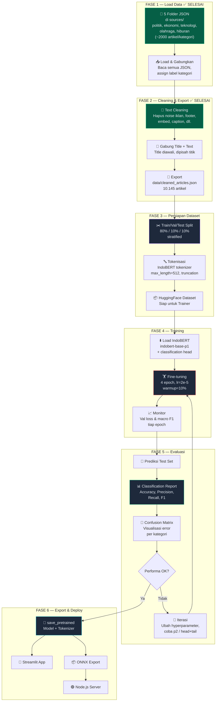
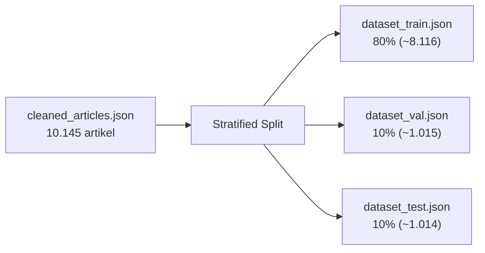
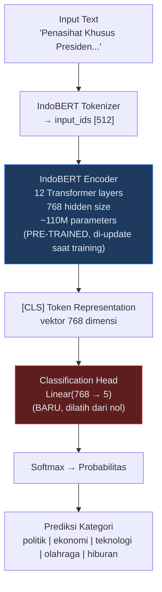
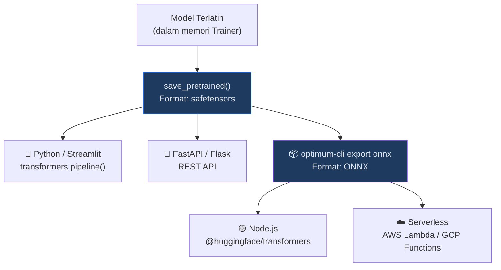

# 🗞️ Rencana Menyeluruh v3: Klasifikasi Berita dengan IndoBERT

> Pipeline end-to-end dari data mentah CNN Indonesia hingga model siap deploy.
> 
> **v3** — Disesuaikan dengan kondisi aktual codebase per 16 Juni 2026.

---

## Status Saat Ini — Ringkasan Perubahan dari v2

### Apa yang Sudah Berubah?

| Aspek | Plan v2 | Kondisi Aktual (v3) | Status |
|---|---|---|---|
| **Root folder** | `berita/` | `berita-experiment/` | ✅ Berubah |
| **Data mentah** | Langsung di root (`1_news-politik/`, dst.) | Dipindah ke `sources/` (`sources/1_news-politik/`, dst.) | ✅ Berubah |
| **Script Fase 1+2** | `_processing_plan/1_load_and_clean.py` | `_processing_plan/1_load_and_clean.ipynb` (Jupyter Notebook) | ✅ Berubah |
| **Nama output cleaned** | `data/dataset_cleaned.json` | `data/cleaned_articles.json` | ✅ Berubah |
| **Validasi teks pendek** | Skip artikel < 50 karakter | Tidak dilakukan (semua 10.145 artikel lolos) | ✅ Berubah |
| **Field output** | Hanya `text`, `label`, `category` | Menyimpan juga `title` (terpisah, selain gabungan di `text`) | ✅ Berubah |
| **BASE_DIR** | `c:\yuriCode\personal_github\NLP\berita` | `./sources` (relative path dari root proyek) | ✅ Berubah |

### Status Per Fase

| Fase | Status | Catatan |
|---|---|---|
| **FASE 1 — Load Data** | ✅ **SELESAI** | 10.145 artikel berhasil di-load dari 5 kategori |
| **FASE 2 — Cleaning & Export** | ✅ **SELESAI** | Output: `data/cleaned_articles.json` (28MB) |
| **FASE 3 — Persiapan Dataset** | ⬜ Belum dimulai | — |
| **FASE 4 — Training** | ⬜ Belum dimulai | — |
| **FASE 5 — Evaluasi** | ⬜ Belum dimulai | — |
| **FASE 6 — Export & Deploy** | ⬜ Belum dimulai | — |

---

## Diagram Alur Keseluruhan



---

## Struktur File Proyek (Aktual + Target)

```
berita-experiment/
├── sources/                                    ← data mentah (sudah ada ✅)
│   ├── 1_news-politik/
│   │   └── 3_politik_cnn_articles.json
│   ├── 2_news-ekonomi/
│   │   └── 3_ekonomi_cnn_articles.json
│   ├── 3_news-teknologi/
│   │   └── 3_teknologi_cnn_articles.json
│   ├── 4_news-olahraga/
│   │   └── 3_olahraga_cnn_articles.json
│   └── 5_news-hiburan/
│       └── 3_hiburan_cnn_articles.json
│
├── _processing_plan/
│   ├── 1_load_and_clean.ipynb                  ← Fase 1 + 2 (sudah ada ✅)
│   ├── 2_prepare_dataset.ipynb                 ← Fase 3 (belum dibuat)
│   ├── 3_train_model.ipynb                     ← Fase 4 (belum dibuat)
│   ├── 4_evaluate_model.ipynb                  ← Fase 5 (belum dibuat)
│   └── 5_export_model.ipynb                    ← Fase 6 (belum dibuat)
│
├── data/
│   ├── cleaned_articles.json                   ← output Fase 2 (sudah ada ✅, 28MB)
│   ├── dataset_train.json                      ← output Fase 3 (belum dibuat)
│   ├── dataset_val.json                        ← (belum dibuat)
│   └── dataset_test.json                       ← (belum dibuat)
│
├── output/
│   ├── indobert-berita-classifier/             ← checkpoints training
│   ├── saved_model/                            ← model final
│   ├── onnx_model/                             ← model ONNX
│   ├── confusion_matrix.png                    ← output Fase 5
│   └── training_log.json
│
├── venv/                                       ← virtual environment (sudah ada ✅)
├── .gitignore                                  ← (sudah ada ✅)
├── readme.md                                   ← (sudah ada ✅, minimal)
├── implementation_plan_v3.md                   ← plan ini
└── app_streamlit.py                            ← deployment Streamlit (belum dibuat)
```

> [!NOTE]
> **Perubahan konvensi dari v2:** Semua script processing menggunakan format **Jupyter Notebook** (`.ipynb`) bukan `.py`. Ini memungkinkan eksplorasi interaktif dan dokumentasi inline yang lebih baik.

---

## FASE 1 — Load Data ✅ SELESAI

### Implementasi

Diimplementasikan di [1_load_and_clean.ipynb](file:///c:/yuriCode/personal_github/NLP/berita-experiment/_processing_plan/1_load_and_clean.ipynb) (cell 1–3).

### Apa yang Dilakukan

- Membaca 5 file JSON dari folder `sources/` (bukan root folder seperti di v2)
- Menggunakan `pathlib.Path` (bukan `os.path.join` seperti di v2)
- Menggunakan relative path `./sources` (bukan absolute path)
- Assign label numerik 0–4 ke setiap kategori

### Hasil

| Kategori | Jumlah Artikel |
|---|---|
| Politik | 2.032 |
| Ekonomi | 2.028 |
| Teknologi | 2.027 |
| Olahraga | 2.029 |
| Hiburan | 2.029 |
| **Total** | **10.145** |

### Perbedaan dengan Plan v2

| Aspek | Plan v2 | Implementasi Aktual |
|---|---|---|
| Base directory | `c:\yuriCode\personal_github\NLP\berita` (absolute) | `./sources` (relative) |
| Path handling | `os.path.join()` | `pathlib.Path` |
| Data mentah lokasi | Root folder langsung | Sub-folder `sources/` |

---

## FASE 2 — Cleaning & Export ✅ SELESAI

### Implementasi

Diimplementasikan di [1_load_and_clean.ipynb](file:///c:/yuriCode/personal_github/NLP/berita-experiment/_processing_plan/1_load_and_clean.ipynb) (cell 4–8).

### Apa yang Dilakukan

1. **Cleaning teks** — 10 langkah pembersihan noise (sama seperti v2):
   - Hapus prefix `--`, iklan ADVERTISEMENT, footer scraper, embed Gambas
   - Hapus navigasi halaman, Pilihan Redaksi, caption foto, karakter X tunggal
   - Normalisasi newline dan whitespace

2. **Gabung title + text** — Title ditempatkan di awal, dipisahkan titik (`.`)

3. **Export** — Disimpan ke `data/cleaned_articles.json`

### Hasil

```
Total artikel : 10.145 (semua lolos, tidak ada yang dibuang)
Panjang teks (kata):
  Rata-rata : 366
  Min       : 22
  Max       : 4.692
```

### Perbedaan dengan Plan v2

| Aspek | Plan v2 | Implementasi Aktual |
|---|---|---|
| Validasi teks pendek | Skip artikel < 50 karakter | **Tidak dilakukan** — semua artikel lolos |
| Nama output file | `data/dataset_cleaned.json` | `data/cleaned_articles.json` |
| Field dalam output JSON | `text`, `label`, `category` | `title`, `text`, `label`, `category` (title tetap disimpan terpisah) |
| Fungsi export | `validate_and_export()` yang gabung cleaning + validasi + export | Cleaning & combine terpisah, export via `validate_and_export()` yang hanya print ringkasan + simpan |

> [!IMPORTANT]
> **Perlu keputusan user:** Artikel terpendek hanya 22 kata. Di v2, ada filter < 50 karakter. Apakah ingin menambahkan filter ini di tahap split (Fase 3), atau biarkan semua masuk ke training?

### Format Output `cleaned_articles.json`

```json
[
  {
    "title": "Kata Istana soal Ketua Ombudsman Hery Susanto Dipecat Tidak Hormat",
    "text": "Kata Istana soal Ketua Ombudsman Hery Susanto Dipecat Tidak Hormat. Menteri Sekretaris Negara Prasetyo Hadi menyatakan pihaknya menghormati keputusan...",
    "label": 0,
    "category": "politik"
  }
]
```

> [!NOTE]
> Berbeda dengan v2, field `title` tetap disimpan terpisah di output JSON. Field `text` sudah berisi gabungan title + body. Field `title` bisa berguna untuk analisis tambahan di kemudian hari.

---

## FASE 3 — Persiapan Dataset untuk Training ⬜ BELUM

### Tujuan

Membagi data bersih menjadi train/val/test, lalu mentokenisasi menjadi format yang siap dikonsumsi oleh HuggingFace `Trainer`.

### 3.1 Train/Val/Test Split



> [!IMPORTANT]
> **Stratified split** memastikan setiap subset (train/val/test) memiliki **proporsi kelas yang sama** dengan dataset asli. Ini krusial agar evaluasi fair.

### Kode Referensi: Split Data

> [!WARNING]
> Path input disesuaikan: menggunakan `data/cleaned_articles.json` (bukan `data/dataset_cleaned.json` seperti v2).

```python
from sklearn.model_selection import train_test_split
import json
import os

# Load data bersih dari Fase 2
with open("./data/cleaned_articles.json", "r", encoding="utf-8") as f:
    cleaned_data = json.load(f)

labels = [d["label"] for d in cleaned_data]

# Split 1: 80% train, 20% temp
train_data, temp_data = train_test_split(
    cleaned_data,
    test_size=0.2,
    random_state=42,
    stratify=labels
)

# Split 2: 50/50 dari temp → 10% val, 10% test
temp_labels = [d["label"] for d in temp_data]
val_data, test_data = train_test_split(
    temp_data,
    test_size=0.5,
    random_state=42,
    stratify=temp_labels
)

print(f"Train : {len(train_data)} artikel")
print(f"Val   : {len(val_data)} artikel")
print(f"Test  : {len(test_data)} artikel")

# Simpan
data_dir = "./data"
os.makedirs(data_dir, exist_ok=True)

for name, data in [("train", train_data), ("val", val_data), ("test", test_data)]:
    path = os.path.join(data_dir, f"dataset_{name}.json")
    with open(path, "w", encoding="utf-8") as f:
        json.dump(data, f, ensure_ascii=False, indent=2)
    print(f"  ✅ Saved {path}")
```

### 3.2 Strategi Penanganan Teks Panjang

> [!IMPORTANT]
> **Masalah:** BERT memiliki batas **512 token** (~380 kata Indonesia). Rata-rata artikel 366 kata — sekitar setengahnya melebihi batas.
>
> **Solusi:** Gunakan **truncation** (potong di 512 token pertama). Ini bekerja baik untuk berita karena prinsip **piramida terbalik** jurnalistik — informasi terpenting selalu di paragraf awal.

| Opsi | Cara Kerja | Kompleksitas | Kapan Digunakan |
|---|---|---|---|
| **A. Truncation** ✅ | Ambil 512 token pertama | Rendah | **Mulai dari sini** — sudah cukup baik untuk berita |
| **B. Head + Tail** | 256 token awal + 256 token akhir | Sedang | Jika Opsi A kurang akurat |
| **C. Chunking** | Pecah jadi beberapa potongan 512, voting | Tinggi | Untuk dokumen sangat panjang yang butuh konteks penuh |

### 3.3 Tokenisasi

```python
from transformers import AutoTokenizer
from datasets import Dataset
import json

MODEL_NAME = "indobenchmark/indobert-base-p1"
MAX_LENGTH = 512

# 1. Load tokenizer
tokenizer = AutoTokenizer.from_pretrained(MODEL_NAME)

# 2. Load data dari file JSON
def load_dataset_from_json(filepath):
    with open(filepath, "r", encoding="utf-8") as f:
        data = json.load(f)
    return Dataset.from_list([
        {"text": d["text"], "label": d["label"]}
        for d in data
    ])

train_ds = load_dataset_from_json("./data/dataset_train.json")
val_ds   = load_dataset_from_json("./data/dataset_val.json")
test_ds  = load_dataset_from_json("./data/dataset_test.json")

# 3. Fungsi tokenisasi
def tokenize_fn(examples):
    return tokenizer(
        examples["text"],
        truncation=True,
        padding="max_length",
        max_length=MAX_LENGTH,
    )

# 4. Tokenisasi semua dataset
train_ds = train_ds.map(tokenize_fn, batched=True, desc="Tokenisasi train")
val_ds   = val_ds.map(tokenize_fn, batched=True, desc="Tokenisasi val")
test_ds  = test_ds.map(tokenize_fn, batched=True, desc="Tokenisasi test")

# 5. Set format untuk PyTorch
train_ds.set_format("torch", columns=["input_ids", "attention_mask", "token_type_ids", "label"])
val_ds.set_format("torch", columns=["input_ids", "attention_mask", "token_type_ids", "label"])
test_ds.set_format("torch", columns=["input_ids", "attention_mask", "token_type_ids", "label"])
```

---

## FASE 4 — Training dengan IndoBERT ⬜ BELUM

### Tujuan

Fine-tune model `indobenchmark/indobert-base-p1` dengan menambahkan classification head untuk 5 kategori berita.

### Arsitektur Model



### Ringkasan Hyperparameter

| Parameter | Nilai | Alasan |
|---|---|---|
| `num_train_epochs` | 4 | Sweet spot untuk dataset ~8k; 3-5 optimal untuk BERT |
| `learning_rate` | 2e-5 | Standard untuk fine-tuning BERT — cukup kecil untuk tidak merusak pre-trained weights |
| `per_device_train_batch_size` | 8 | Aman untuk GPU 8GB; naikkan ke 16 jika GPU >12GB |
| `per_device_eval_batch_size` | 16 | Evaluasi tidak butuh gradient → bisa lebih besar |
| `weight_decay` | 0.01 | Regularisasi L2 standar untuk BERT |
| `warmup_ratio` | 0.1 | 10% awal training menggunakan learning rate yang naik bertahap |
| `eval_strategy` | "epoch" | Evaluasi setiap akhir epoch |
| `load_best_model_at_end` | True | Otomatis load checkpoint dengan macro_f1 tertinggi |
| `metric_for_best_model` | "macro_f1" | F1 lebih representatif dari accuracy untuk multi-class |
| `seed` | 42 | Reproducibility |

### Kode Referensi: Training

```python
import numpy as np
from sklearn.metrics import classification_report, accuracy_score
from transformers import (
    AutoTokenizer,
    AutoModelForSequenceClassification,
    TrainingArguments,
    Trainer,
)
from datasets import Dataset
import json

# ===================================================================
# KONFIGURASI
# ===================================================================
MODEL_NAME = "indobenchmark/indobert-base-p1"
MAX_LENGTH = 512
NUM_LABELS = 5
LABEL_NAMES = ["politik", "ekonomi", "teknologi", "olahraga", "hiburan"]
OUTPUT_DIR = "./output/indobert-berita-classifier"

# ===================================================================
# 1. LOAD DATA & TOKENIZE (sama seperti Fase 3)
# ===================================================================
tokenizer = AutoTokenizer.from_pretrained(MODEL_NAME)

def load_dataset_from_json(filepath):
    with open(filepath, "r", encoding="utf-8") as f:
        data = json.load(f)
    return Dataset.from_list([{"text": d["text"], "label": d["label"]} for d in data])

def tokenize_fn(examples):
    return tokenizer(examples["text"], truncation=True, padding="max_length", max_length=MAX_LENGTH)

train_ds = load_dataset_from_json("./data/dataset_train.json").map(tokenize_fn, batched=True)
val_ds   = load_dataset_from_json("./data/dataset_val.json").map(tokenize_fn, batched=True)
test_ds  = load_dataset_from_json("./data/dataset_test.json").map(tokenize_fn, batched=True)

# ===================================================================
# 2. LOAD MODEL
# ===================================================================
model = AutoModelForSequenceClassification.from_pretrained(
    MODEL_NAME,
    num_labels=NUM_LABELS,
    id2label={i: name for i, name in enumerate(LABEL_NAMES)},
    label2id={name: i for i, name in enumerate(LABEL_NAMES)},
)

print(f"Model loaded: {MODEL_NAME}")
print(f"Total parameters: {sum(p.numel() for p in model.parameters()):,}")

# ===================================================================
# 3. METRICS
# ===================================================================
def compute_metrics(eval_pred):
    """Hitung metrik evaluasi pada setiap akhir epoch."""
    logits, labels = eval_pred
    predictions = np.argmax(logits, axis=-1)
    
    acc = accuracy_score(labels, predictions)
    report = classification_report(
        labels, predictions,
        target_names=LABEL_NAMES,
        output_dict=True,
        zero_division=0,
    )
    
    return {
        "accuracy": acc,
        "macro_f1": report["macro avg"]["f1-score"],
        "macro_precision": report["macro avg"]["precision"],
        "macro_recall": report["macro avg"]["recall"],
        "weighted_f1": report["weighted avg"]["f1-score"],
    }

# ===================================================================
# 4. TRAINING ARGUMENTS
# ===================================================================
training_args = TrainingArguments(
    output_dir=OUTPUT_DIR,
    
    # Hyperparameters
    num_train_epochs=4,
    per_device_train_batch_size=8,
    per_device_eval_batch_size=16,
    learning_rate=2e-5,
    weight_decay=0.01,
    warmup_ratio=0.1,
    
    # Evaluation & Saving
    eval_strategy="epoch",
    save_strategy="epoch",
    load_best_model_at_end=True,
    metric_for_best_model="macro_f1",
    greater_is_better=True,
    save_total_limit=2,
    
    # Logging
    logging_dir=f"{OUTPUT_DIR}/logs",
    logging_steps=50,
    report_to="none",
    
    # Reproducibility
    seed=42,
    
    # GPU Optimization (uncomment jika GPU mendukung)
    # fp16=True,
    # gradient_accumulation_steps=2,
)

# ===================================================================
# 5. TRAINER
# ===================================================================
trainer = Trainer(
    model=model,
    args=training_args,
    train_dataset=train_ds,
    eval_dataset=val_ds,
    compute_metrics=compute_metrics,
)

# ===================================================================
# 6. MULAI TRAINING
# ===================================================================
print("\n" + "="*60)
print("MULAI TRAINING")
print("="*60)
print(f"  Model          : {MODEL_NAME}")
print(f"  Train samples  : {len(train_ds)}")
print(f"  Val samples    : {len(val_ds)}")
print(f"  Epochs         : {training_args.num_train_epochs}")
print(f"  Batch size     : {training_args.per_device_train_batch_size}")
print(f"  Learning rate  : {training_args.learning_rate}")
print(f"  Total steps    : {len(train_ds) // training_args.per_device_train_batch_size * int(training_args.num_train_epochs)}")
print("="*60 + "\n")

train_result = trainer.train()

# Log training result
print(f"\n  Training time     : {train_result.metrics['train_runtime']:.0f} detik")
print(f"  Samples/detik     : {train_result.metrics['train_samples_per_second']:.1f}")
```

### Output Training yang Diharapkan (per epoch)

```
Epoch  Train Loss   Val Loss   Accuracy   Macro F1
  1      0.82        0.45       0.85       0.84
  2      0.35        0.32       0.89       0.89
  3      0.18        0.28       0.91       0.91
  4      0.10        0.30       0.91       0.90    ← early sign of overfitting
```

> [!TIP]
> **Baca tabel training log:**
> - `Train Loss` turun setiap epoch → model belajar
> - `Val Loss` mulai naik sementara train loss masih turun → **overfitting**
> - `load_best_model_at_end=True` otomatis memilih model dari epoch terbaik (epoch 3 di contoh ini)

---

## FASE 5 — Evaluasi Model ⬜ BELUM

### Tujuan

Mengukur performa model pada **test set** (data yang tidak pernah dilihat model selama training), menggunakan metrik standar dan visualisasi confusion matrix.

### Penjelasan Metrik

| Metrik | Formula Sederhana | Arti |
|---|---|---|
| **Accuracy** | Prediksi benar / Total | Persentase prediksi yang tepat secara keseluruhan |
| **Precision** | TP / (TP + FP) | Dari yang diprediksi kelas X, berapa % yang memang kelas X? |
| **Recall** | TP / (TP + FN) | Dari semua yang benar kelas X, berapa % yang berhasil ditangkap? |
| **F1-Score** | 2 × (P × R) / (P + R) | Harmonic mean precision & recall — metrik utama |
| **Macro Avg** | Rata-rata per kelas (bobot sama) | Fair untuk semua kelas meski distribusi berbeda |
| **Weighted Avg** | Rata-rata berbobot support | Memperhitungkan jumlah sampel per kelas |

### Kode Referensi: Evaluasi Lengkap

```python
import numpy as np
from sklearn.metrics import (
    classification_report,
    confusion_matrix,
    ConfusionMatrixDisplay,
    accuracy_score,
)
import matplotlib.pyplot as plt
import json
import os

# ===================================================================
# 1. PREDIKSI DI TEST SET
# ===================================================================
print("Menjalankan prediksi di test set...")
predictions = trainer.predict(test_ds)

preds = np.argmax(predictions.predictions, axis=-1)
labels = predictions.label_ids

# ===================================================================
# 2. CLASSIFICATION REPORT
# ===================================================================
print("\n" + "="*60)
print("CLASSIFICATION REPORT — TEST SET")
print("="*60)

report_text = classification_report(labels, preds, target_names=LABEL_NAMES)
print(report_text)

report_dict = classification_report(labels, preds, target_names=LABEL_NAMES, output_dict=True)

# Simpan report sebagai JSON
report_path = os.path.join(OUTPUT_DIR, "classification_report.json")
with open(report_path, "w") as f:
    json.dump(report_dict, f, indent=2)
print(f"  ✅ Report disimpan ke: {report_path}")

# ===================================================================
# 3. CONFUSION MATRIX
# ===================================================================
cm = confusion_matrix(labels, preds)

fig, ax = plt.subplots(figsize=(10, 8))
disp = ConfusionMatrixDisplay(confusion_matrix=cm, display_labels=LABEL_NAMES)
disp.plot(
    ax=ax,
    cmap="Blues",
    values_format="d",
    xticks_rotation=45,
)
ax.set_title("Confusion Matrix — IndoBERT Berita Classifier", fontsize=14, fontweight="bold")
ax.set_ylabel("Label Sebenarnya", fontsize=12)
ax.set_xlabel("Prediksi Model", fontsize=12)
plt.tight_layout()

cm_path = os.path.join(OUTPUT_DIR, "confusion_matrix.png")
plt.savefig(cm_path, dpi=150, bbox_inches="tight")
plt.show()
print(f"  ✅ Confusion matrix disimpan ke: {cm_path}")

# ===================================================================
# 4. RINGKASAN EVALUASI
# ===================================================================
print("\n" + "="*60)
print("RINGKASAN EVALUASI")
print("="*60)
print(f"  Accuracy       : {report_dict['accuracy']:.4f}")
print(f"  Macro F1       : {report_dict['macro avg']['f1-score']:.4f}")
print(f"  Weighted F1    : {report_dict['weighted avg']['f1-score']:.4f}")
print()
print("  Per kategori (F1-Score):")
for label in LABEL_NAMES:
    f1 = report_dict[label]["f1-score"]
    bar = "█" * int(f1 * 40)
    print(f"    {label:>12}: {f1:.3f} {bar}")
```

### Cara Membaca Confusion Matrix

```
                   Prediksi Model
                 pol  eko  tek  ola  hib
Label        ┌────────────────────────────┐
Sebenarnya   │                            │
  politik    │ 185   8    5    2    3     │ ← 185 benar, 8 salah prediksi ekonomi
  ekonomi    │  10  182   6    1    4     │
  teknologi  │   4   7  184   2    6     │
  olahraga   │   1   0    2  197   3     │ ← olahraga paling akurat
  hiburan    │   3   5    8    2  185    │
             └────────────────────────────┘
```

- **Diagonal** (kiri atas → kanan bawah) = prediksi **benar**
- **Off-diagonal** = prediksi **salah** (error)
- Baris = label asli, Kolom = prediksi model
- Sel `[politik, ekonomi] = 8` artinya 8 artikel politik diprediksi sebagai ekonomi

### Jika Performa Kurang Memuaskan

| Masalah | Indikator | Solusi |
|---|---|---|
| **Overfitting** | Train loss sangat rendah, val loss naik | Kurangi epoch, tambah dropout, tambah data |
| **Underfitting** | Val loss masih tinggi setelah 4 epoch | Naikkan epoch, naikkan learning rate sedikit |
| **Kelas tertentu rendah** | F1 satu kategori <0.80 | Periksa data kelas itu, tambah data, coba head+tail |
| **Semua kelas biasa saja** | Macro F1 <0.85 | Coba `indobert-base-p2`, coba DAPT dulu |

---

## FASE 6 — Export Model & Deployment ⬜ BELUM

### Tujuan

Menyimpan model yang sudah dilatih dalam format yang bisa digunakan di sistem lain (Streamlit, Node.js, REST API).

### Diagram Opsi Deployment



### 6.1 Simpan Model (Format HuggingFace)

```python
SAVE_DIR = "./output/saved_model"

# Simpan model + tokenizer
model.save_pretrained(SAVE_DIR)
tokenizer.save_pretrained(SAVE_DIR)

print(f"✅ Model disimpan ke: {SAVE_DIR}")
```

### 6.2 Verifikasi Model yang Disimpan

```python
from transformers import pipeline

classifier = pipeline(
    "text-classification",
    model=SAVE_DIR,
    tokenizer=SAVE_DIR,
    top_k=5,
    device="cpu",
)

# Test prediksi
sample_texts = [
    "Presiden Prabowo meresmikan proyek infrastruktur strategis nasional di Papua",
    "IHSG ditutup menguat 1,5 persen pada perdagangan Senin",
    "Apple meluncurkan iPhone 18 dengan chip A20 Bionic terbaru",
    "Timnas Indonesia lolos ke babak semifinal Piala AFF 2026",
    "Film Dilan 3 meraih penonton terbanyak sepanjang 2026",
]

print("VERIFIKASI MODEL TERSIMPAN")
print("="*60)
for text in sample_texts:
    result = classifier(text)
    top = result[0]
    print(f"\n  Teks: \"{text[:70]}...\"")
    print(f"  → Prediksi: {top['label']} ({top['score']:.2%})")
```

### 6.3 Deploy di Streamlit

```python
# app_streamlit.py
import streamlit as st
from transformers import pipeline

@st.cache_resource
def load_classifier():
    return pipeline(
        "text-classification",
        model="./output/saved_model",
        tokenizer="./output/saved_model",
        top_k=5,
    )

classifier = load_classifier()

st.set_page_config(page_title="Klasifikasi Berita", page_icon="🗞️", layout="centered")
st.title("🗞️ Klasifikasi Berita Indonesia")
st.caption("Powered by IndoBERT — Fine-tuned pada berita CNN Indonesia")

text_input = st.text_area(
    "Masukkan teks berita:",
    height=200,
    placeholder="Tempel atau ketik teks berita di sini..."
)

if st.button("🔍 Klasifikasi", type="primary"):
    if text_input.strip():
        with st.spinner("Menganalisis..."):
            results = classifier(text_input)
        
        st.subheader("📊 Hasil Prediksi")
        for result in results:
            label = result["label"]
            score = result["score"]
            
            emoji_map = {
                "politik": "🏛️", "ekonomi": "💰", "teknologi": "🔬",
                "olahraga": "⚽", "hiburan": "🎬"
            }
            emoji = emoji_map.get(label, "📄")
            
            col1, col2 = st.columns([3, 1])
            with col1:
                st.progress(score, text=f"{emoji} {label}")
            with col2:
                st.write(f"**{score:.1%}**")
    else:
        st.warning("Masukkan teks berita terlebih dahulu!")

# ===================================================================
# CARA MENJALANKAN:
#   streamlit run app_streamlit.py
# ===================================================================
```

### 6.4 Export ke ONNX & Deploy di Node.js

**Step 1: Export ke ONNX**
```bash
pip install optimum onnx onnxruntime
optimum-cli export onnx --model ./output/saved_model ./output/onnx_model
```

**Step 2: Node.js Server**
```javascript
// server.js
const express = require("express");
const { pipeline } = require("@huggingface/transformers");

let classifier;

async function initModel() {
  console.log("Loading model...");
  classifier = await pipeline("text-classification", "./output/onnx_model", {
    device: "cpu",
  });
  console.log("Model loaded ✅");
}

const app = express();
app.use(express.json());

app.post("/classify", async (req, res) => {
  const { text } = req.body;
  
  if (!text) {
    return res.status(400).json({ error: "Field 'text' wajib diisi" });
  }
  
  const results = await classifier(text, { topk: 5 });
  res.json({
    predictions: results,
    input_length: text.length,
  });
});

app.get("/health", (req, res) => {
  res.json({ status: "ok", model_loaded: !!classifier });
});

initModel().then(() => {
  app.listen(3000, () => {
    console.log("Server running on http://localhost:3000");
  });
});
```

### Ringkasan Opsi Deployment

| Platform | Format | Library | Ukuran Model | Kecepatan Inferensi |
|---|---|---|---|---|
| **Streamlit** (Python) | safetensors | `transformers` | ~440MB | ~200ms/artikel (CPU) |
| **FastAPI** (Python) | safetensors | `transformers` | ~440MB | ~200ms/artikel (CPU) |
| **Node.js** | ONNX | `@huggingface/transformers` | ~440MB | ~150ms/artikel (CPU) |
| **Serverless** | ONNX | ONNX Runtime | ~440MB | ~300ms/artikel (cold start) |

---

## Checklist Eksekusi

```
[x] Fase 1 — Load Data
    [x] Load semua file JSON per kategori dari sources/
    [x] Assign label numerik (0–4)
    [x] Validasi jumlah artikel per kategori (10.145 total)

[x] Fase 2 — Cleaning & Export
    [x] Implementasi fungsi clean_text() (10 langkah)
    [x] Jalankan cleaning pada semua artikel
    [x] Gabungkan title + text (combine_title_and_text)
    [x] Export ke data/cleaned_articles.json (28MB)

[ ] Fase 3 — Persiapan Dataset
    [ ] Buat notebook 2_prepare_dataset.ipynb
    [ ] Load cleaned_articles.json
    [ ] Split 80/10/10 stratified
    [ ] Export dataset_train/val/test.json
    [ ] Load tokenizer IndoBERT
    [ ] Tokenisasi semua split
    [ ] Verifikasi shape output tokenizer

[ ] Fase 4 — Training
    [ ] Buat notebook 3_train_model.ipynb
    [ ] Download model indobert-base-p1
    [ ] Konfigurasi TrainingArguments
    [ ] Jalankan training
    [ ] Monitor training/val loss per epoch

[ ] Fase 5 — Evaluasi
    [ ] Buat notebook 4_evaluate_model.ipynb
    [ ] Prediksi di test set
    [ ] Print classification report
    [ ] Generate confusion matrix
    [ ] Simpan report JSON & confusion matrix PNG
    [ ] Evaluasi apakah performa memuaskan

[ ] Fase 6 — Export & Deploy
    [ ] Buat notebook 5_export_model.ipynb
    [ ] save_pretrained model + tokenizer
    [ ] Verifikasi model tersimpan (test prediksi)
    [ ] (Opsional) Deploy Streamlit
    [ ] (Opsional) Export ONNX + deploy Node.js
```

---

## Open Questions

> [!IMPORTANT]
> **Q1: Filter artikel pendek?**
> Artikel terpendek saat ini 22 kata. Plan v2 mengusulkan filter < 50 karakter. Apakah ingin menambahkan langkah filter ini di awal Fase 3 (sebelum split), atau biarkan semua artikel masuk training?

> [!IMPORTANT]
> **Q2: Field `title` di output split?**
> `cleaned_articles.json` menyimpan `title` secara terpisah. Saat split ke `dataset_train/val/test.json`, apakah field `title` ikut disimpan (untuk referensi), atau cukup `text` dan `label` saja (lebih ringan)?

---

## Dependencies yang Dibutuhkan

```bash
pip install transformers datasets torch scikit-learn matplotlib
# Opsional:
pip install streamlit                    # untuk deployment Streamlit
pip install optimum onnx onnxruntime     # untuk export ONNX
```

> [!WARNING]
> **PyTorch:** Pastikan install versi yang sesuai dengan GPU Anda. Cek di [pytorch.org](https://pytorch.org/get-started/locally/) untuk command yang tepat. Jika hanya CPU:
> ```bash
> pip install torch --index-url https://download.pytorch.org/whl/cpu
> ```
